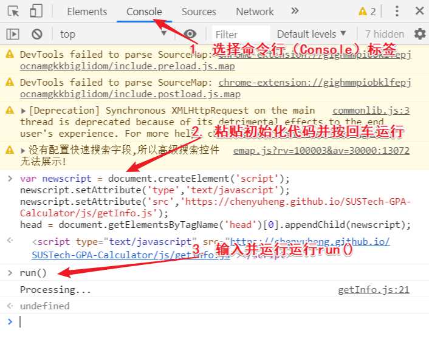

# 南科大 GPA 计算器

## 特性

* 自动处理课程成绩信息。

* 支持选择特定课程计算 GPA（可用于专业 GPA 的计算等）。

* 课程成绩信息保存在 GPA 计算器页面地址中，复制页面地址即可保存或者传递课程成绩信息。


## 使用说明

### 使用平台要求

**导入课程成绩信息：** PC 端 chrome 浏览器，或其他支持命令行操作的浏览器。

**浏览计算 GPA：** PC端或手机端浏览器皆可。

### 导入课程成绩信息步骤

1. 复制如下初始化代码：

```javascript
var newscript = document.createElement('script');
newscript.setAttribute('type','text/javascript');
newscript.setAttribute('src','https://chenyuheng.github.io/SUSTech-GPA-Calculator/js/getInfo.js');
head = document.getElementsByTagName('head')[0].appendChild(newscript);
```

2. [点击此链接](http://ehall.sustech.edu.cn/xhxsfw/sys/xsjwxx/*default/index.do)进入 ehall 学业信息页面。如未登录，请先登录。

3. 按<code>F12</code>按键进入开发者模式，选择命令行（Console），在命令行位置粘贴刚刚复制的代码，按下回车执行代码。

4. 然后输入<code>run()</code>，按下回车运行，此时会弹出 GPA 计算器的页面。如果浏览器屏蔽了自动弹窗，请取消屏蔽。

   

## Demo

### 链接地址

[点击此处进入](https://chenyuheng.github.io/SUSTech-GPA-Calculator/content.html?courseLength=7&t0=A&cc0=GE100&g0=P&cn0=%E5%86%9B%E4%BA%8B%E7%90%86%E8%AE%BA%E4%B8%8E%E8%AE%AD%E7%BB%83&d0=%E4%B9%A6%E9%99%A2&s0=2017-2018-1&c0=2&lh0=48&t1=D&cc1=CH101A&g1=A&cn1=%E5%8C%96%E5%AD%A6%E5%8E%9F%E7%90%86%20A+&d1=%E5%8C%96%E5%AD%A6%E7%B3%BB&s1=2017-2018-1&c1=4&lh1=64&t2=D&cc2=CS102A&g2=B&cn2=%E8%AE%A1%E7%AE%97%E6%9C%BA%E7%A8%8B%E5%BA%8F%E8%AE%BE%E8%AE%A1%E5%9F%BA%E7%A1%80A&d2=%E8%AE%A1%E7%AE%97%E6%9C%BA%E7%A7%91%E5%AD%A6%E4%B8%8E%E5%B7%A5%E7%A8%8B%E7%B3%BB&s2=2017-2018-1&c2=3&lh2=64&t3=D&cc3=MA103A&g3=C-&cn3=%E7%BA%BF%E6%80%A7%E4%BB%A3%E6%95%B0I-A&d3=%E6%95%B0%E5%AD%A6%E7%B3%BB&s3=2017-2018-1&c3=4&lh3=64&t4=D&cc4=CLE021&g4=D-&cn4=SUSTech%20English%20I&d4=%E8%AF%AD%E8%A8%80%E4%B8%AD%E5%BF%83&s4=2017-2018-1&c4=4&lh4=64&t5=D&cc5=MA101B&g5=F&cn5=%E9%AB%98%E7%AD%89%E6%95%B0%E5%AD%A6%EF%BC%88%E4%B8%8A%EF%BC%89A&d5=%E6%95%B0%E5%AD%A6%E7%B3%BB&s5=2017-2018-1&c5=4&lh5=64&t6=D&cc6=PHY103B&g6=B&cn6=%E5%A4%A7%E5%AD%A6%E7%89%A9%E7%90%86%20B(%E4%B8%8A)&d6=%E7%89%A9%E7%90%86%E7%B3%BB&s6=2017-2018-1&c6=4&lh6=64)

### 截图


