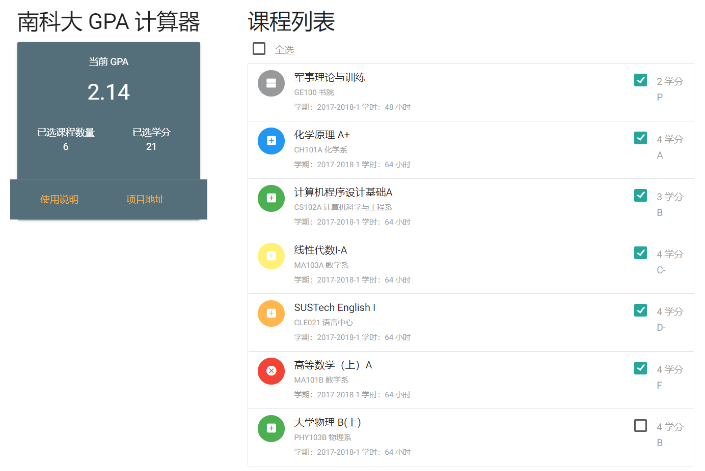

# 南科大 GPA 计算器

## 特性

* 自动导出课程成绩信息。
* 支持选择特定课程计算 GPA（可用于专业 GPA 的计算等）。
* 课程成绩信息保存在 GPA 计算器页面地址中，复制页面地址即可保存或者传递课程成绩信息。
* （更新）选中课程信息也可以保存在地址栏。


## 使用说明

### 使用平台要求

**导入课程成绩信息：** PC 端 chrome 浏览器，或其他支持命令行操作的浏览器。

**浏览计算 GPA：** PC端或手机端浏览器皆可。

### 导入课程成绩信息步骤

1. 复制如下代码：

```javascript
var newscript = document.createElement('script');newscript.setAttribute('type','text/javascript');newscript.setAttribute('src','https://chenyuheng.github.io/SUSTech-GPA-Calculator/js/getInfo.js');head = document.getElementsByTagName('head')[0].appendChild(newscript);run();
```

2. [点击此链接](http://ehall.sustech.edu.cn/xhxsfw/sys/xsjwxx/*default/index.do)进入 ehall 学业信息页面。如未登录，请先登录。

3. 在浏览器地址栏**手动**输入如下代码：
```javascript
javascript:
```
4. 在浏览器地址栏如上代码的后面粘贴在第一步钟复制的代码，并按下回车键，稍等片刻，计算器页面将会弹出。如果浏览器禁用了弹窗，请改为允许此次弹窗。

## Demo

### 链接地址

[点击此处进入](https://chenyuheng.github.io/SUSTech-GPA-Calculator/content.html?checked=1111111&t0=A&cc0=GE100&g0=P&s0=171&c0=2&lh0=48&t1=D&cc1=CH101A&g1=A&s1=171&c1=4&lh1=64&t2=D&cc2=CS102A&g2=B&s2=171&c2=3&lh2=64&t3=D&cc3=MA103A&g3=C-&s3=171&c3=4&lh3=64&t4=D&cc4=CLE021&g4=D-&s4=171&c4=4&lh4=64&t5=D&cc5=MA101B&g5=F&s5=171&c5=4&lh5=64&t6=D&cc6=PHY103B&g6=B&s6=171&c6=4&lh6=64)

### 截图



## 地址栏参数

| 参数    | 说明                                                         |
| ------- | ------------------------------------------------------------ |
| checked | 对应位数的课程是否被选中。比如1100表示第0、1个课程被选中，第2、3个课程未被选中。未说明部分按选中处理。 |
| t[n]    | 第n个课程的评分方式。A表示二级制（过或不过），D表示等级制（A到F)。 |
| cc[n]   | 第n个课程的课程代码                                          |
| g[n]    | 第n个课程的评分等级（成绩）。                                |
| s[n]    | 第n个课程的修读学期，前2位数表示学年，第2位数表示学期。比如192表示2019-2020学年第2学期。 |
| c[n]    | 第n个课程的学分数。                                          |
| lh[n]   | 第n个课程的总学时。                                          |
| cn[n]   | 第n个课程的课程名，仅在数据库中无课程数据时使用。            |
| d[n]    | 第n个课程的开课部门，仅在数据库中无课程数据时使用。          |

## 感谢

[SUSTech Flow](https://sustechflow.top/) 提供课程信息数据接口。

## 安全声明

本应用脚本不会窃取使用者的任何个人信息，包括校园网账号密码、成绩、已修读课程信息等。
